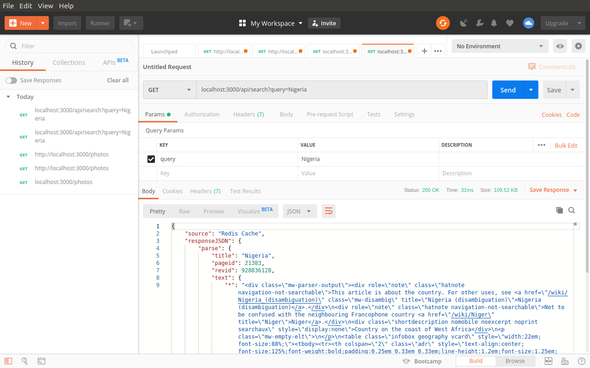

# Redis Cache

Laboratorio Redis para mejorar el manejo de memoria cache.

## Fuente del laboratorio

La fuente de consulta de este laporatorio esta en este [link](https://www.codementor.io/brainyfarm/caching-with-redis-node-js-example-h6o9ii72i)

## Resultado

En las siguientes imagenes se encuentra la comparacion de velocidad al manejar la memoria cache, la primera la consulta tarda 2s y en la segunda 6 milisegundos.

